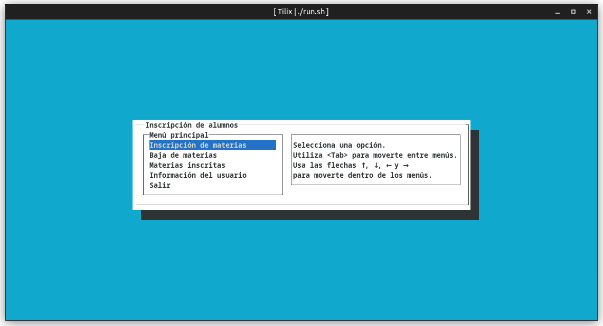
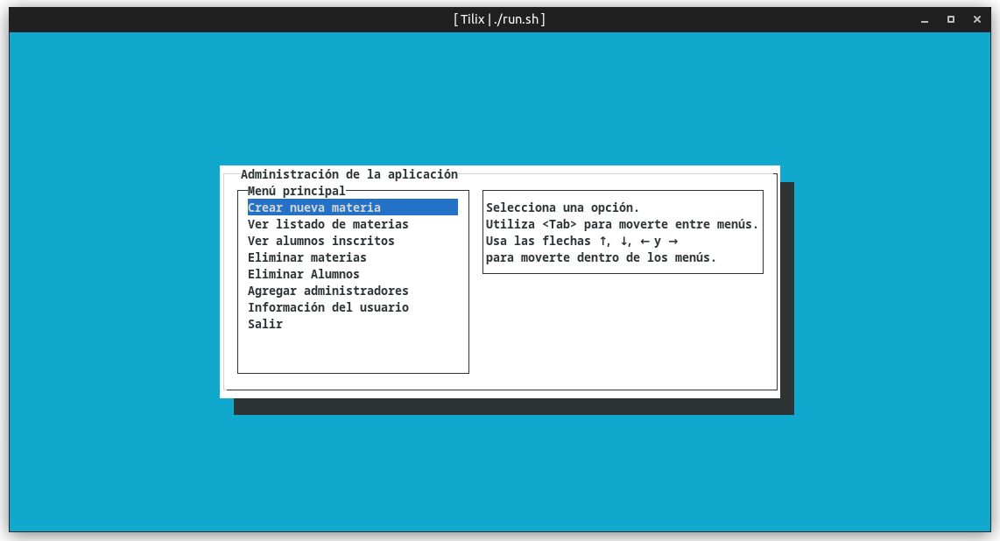
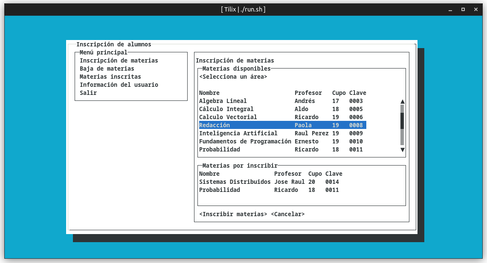

# Proyecto Final Programación Orientada a Objetos

Proyecto final para la materia de Programación Orientada a Objetos

Semestre 2022-1

Integrantes

* Osorio Ángeles Rodrigo Jafet
* Moreno Chalico Edgar Ulises

## Sistema de Inscripciones a cursos
Programa para administrar las inscripciones de los alumnos,
creación y manejo de materias, y almacenarlos en archivos JSON 
(En sustitución de alguna base de datos, ya que no es requisito 
para este proyecto).

## Screenshots
 
Interfaz de los alumnos.

Interfaz de los administradores.

Inscripción de materias

## Dependencias
Para manejar las dependencias, se recomienda instalarlas con Maven o 
usar las incluidas en lib.
* lanterna (com.googlecode.lanterna)
* flexjson (net.sf.flexjson)

## Compilación
Para la compilación, se recomienda usar los scripts
para Linux y Windows incluidos, o los siguientes comandos desde la raíz del proyecto.

Comandos para Linux

    javac -cp ".:lib/*" src/**/*.java -d out/
    cd out
    java -cp ".:../lib/*" com.fiunam.main.Main

Comandos para Windows

    javac -encoding utf8 -classpath ".;lib/lanterna-3.1.1.jar;lib/flexjson-3.3.jar;" src/com/fiunam/main/*.java src/com/fiunam/materias/*.java src/com/fiunam/users/*.java src/com/fiunam/databases/*.java src/com/fiunam/logger/*.java -d out
    cd out
    javaw -classpath "../lib/lanterna-3.1.1.jar;../lib/flexjson-3.3.jar;" com.fiunam.main.Main

Se requiere copiar la carpeta ./json a la carpeta ./out generada en la compilación para usar las materias y usuarios de prueba.

## Ejecución desde scripts
Para únicamente compilar, usar el script de compilación.

    ./CompilarLinux.sh
    ./CompilarWindows.bat

Dentro de la carpeta out se crean los scripts para ejecutar después el programa.

    ./start.sh
    ./start.bat

Para compilar y ejecutar.

    ./run.sh
    ./run.bat

Para crear el .jar directamente.

    (pendiente)

Para Linux probablemente sea necesario dar permisos de ejecución con el siguiente comando.

    chmod +x <script>

# Pendientes

## Generales

- Crear la guia de usuario en GitHub
- Completar el login (métodos de inicio de sesión)
- Crear las materias y cuentas de ejemplo
- Pruebas en Windows
